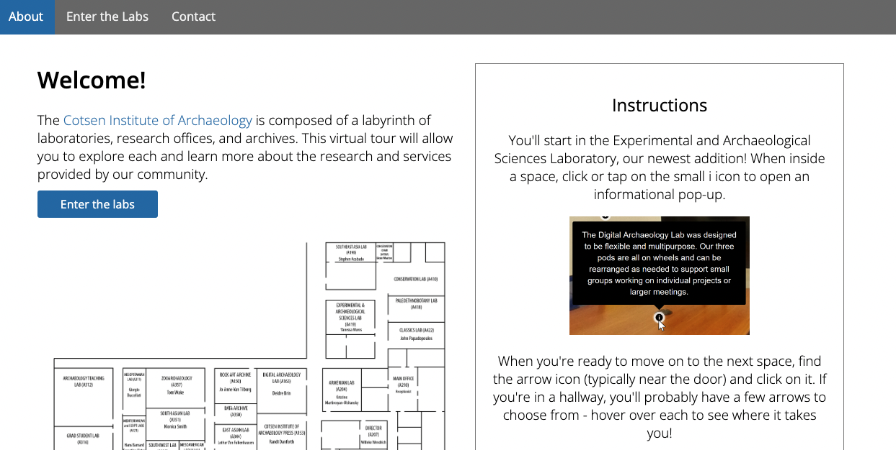
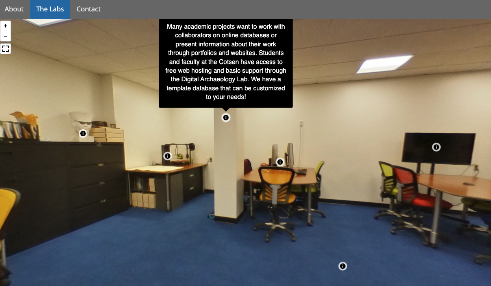
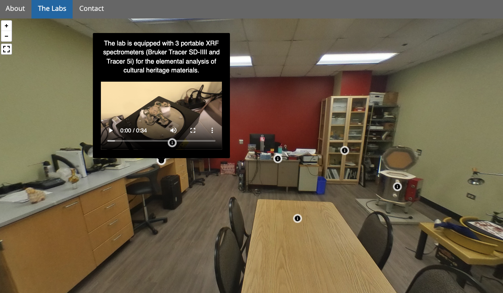

# virtual-lab-tour

Explore the UCLA Cotsen Institute of Archaeology labs - virtually! This repository is the codebase for a simple virtual tour with 360 photos using Pannellum. Each lab has additional information and media provided through popups.

## Set up your own virtual tour

You can use this repository to create your own virtual tour. You'll need access to a webserver and a basic understanding of HTML & CSS but a template guide and instructions are provided in the docs directory to help you get started.

### Credits

#### [Pannellum](https://github.com/mpetroff/pannellum)

- Matthew Petroff, Original Author
- three.js r40, Former Underlying Framework

If used as part of academic research, please cite:

> Petroff, Matthew A. "Pannellum: a lightweight web-based panorama viewer." Journal of Open Source Software 4, no. 40 (2019): 1628. doi:10.21105/joss.01628

### Contact

For additional information, contact the Digital Archaeology Lab at [dal@ioa.ucla.edu](mailto:dal@ioa.ucla.edu).
